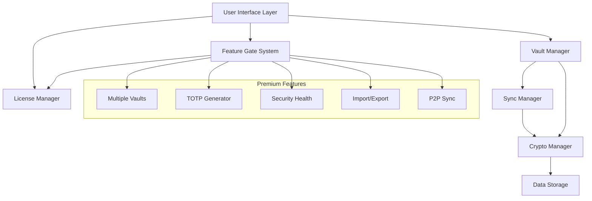
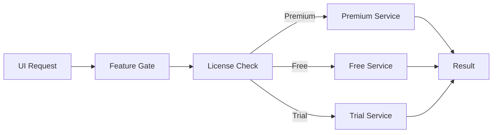
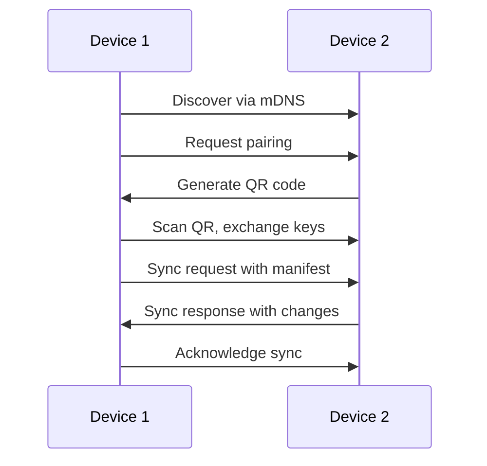

# Freemium Architecture Design

## Overview

The freemium architecture transforms Simple Vault from a single-tier password manager into a sophisticated Android-exclusive freemium product with a compelling free tier and premium features unlocked via one-time purchase through Google Play Billing. The design prioritizes user experience, data security, and seamless feature gating while maintaining the app's core simplicity.

### Key Design Principles

- **Privacy First**: All premium features maintain end-to-end encryption and local-first data storage
- **Graceful Degradation**: Premium features degrade gracefully when licenses expire or fail validation
- **Android Native**: Material Design 3 and Android-specific UI patterns ensure native feel
- **Performance**: Sub-second response times for all core operations, even with large datasets
- **Extensibility**: Architecture supports future premium features without major refactoring

## Architecture

### High-Level System Architecture



### License Management Architecture

The license system uses a hybrid approach combining local storage with Google Play Billing validation:

- **Local License Storage**: Encrypted license data stored using Android Keystore
- **Purchase Validation**: Google Play Billing API for purchase verification and validation
- **Offline Operation**: License validation works offline after initial verification with cached data
- **Grace Period**: 7-day grace period for license validation failures to handle network issues

### Feature Gating Strategy

Features are gated at the service layer rather than UI layer to prevent bypassing:



## Components and Interfaces

### 1. License Manager

**Purpose**: Manages premium license validation, storage, and feature access control.

**Key Interfaces**:
```dart
abstract class LicenseManager {
  Future<LicenseStatus> getCurrentStatus();
  Future<bool> validatePurchase(String purchaseToken);
  Future<void> restorePurchases();
  Stream<LicenseStatus> get statusStream;
}

enum LicenseStatus {
  free,
  trial,
  premium,
  expired,
  validationFailed
}
```

**Design Rationale**: Centralized license management ensures consistent behavior across all features and provides a single point of truth for premium status.

### 2. Feature Gate System

**Purpose**: Controls access to premium features based on license status and provides upgrade prompts.

**Key Interfaces**:
```dart
abstract class FeatureGate {
  bool canAccess(PremiumFeature feature);
  Future<bool> requestAccess(PremiumFeature feature);
  Widget wrapWithGate(Widget child, PremiumFeature feature);
}

enum PremiumFeature {
  multipleVaults,
  totpGenerator,
  securityHealth,
  importExport,
  p2pSync,
  unlimitedPasswords
}
```

**Design Rationale**: Declarative feature gating allows easy addition of new premium features and consistent upgrade flow presentation.

### 3. Multi-Vault Architecture

**Purpose**: Extends the existing single-vault system to support multiple isolated vaults with separate encryption.

**Key Design Decisions**:
- Each vault maintains its own encryption key derived from master password + vault salt
- Vault metadata (name, icon, color) stored separately from encrypted vault data
- Active vault concept maintains backward compatibility with existing single-vault users
- Vault switching requires re-authentication for security

**Data Structure**:
```dart
class VaultMetadata {
  String id;
  String name;
  String iconName;
  Color color;
  DateTime createdAt;
  DateTime lastAccessedAt;
  int passwordCount;
  double securityScore;
}

class VaultManager {
  Future<List<VaultMetadata>> getVaults();
  Future<void> createVault(String name, String iconName, Color color);
  Future<void> switchToVault(String vaultId);
  Future<void> deleteVault(String vaultId);
}
```

### 4. TOTP Integration

**Purpose**: Provides built-in two-factor authentication code generation integrated with password entries.

**Key Design Decisions**:
- TOTP secrets stored encrypted alongside password data
- Real-time code generation with visual countdown indicators
- QR code scanning using device camera with manual entry fallback
- Time synchronization warnings for accuracy

**Integration Pattern**:
```dart
class PasswordEntry {
  // Existing fields...
  TOTPConfig? totpConfig;
}

class TOTPConfig {
  String secret;
  String issuer;
  String accountName;
  int digits; // Usually 6
  int period; // Usually 30 seconds
  TOTPAlgorithm algorithm; // SHA1, SHA256, SHA512
}

class TOTPGenerator {
  String generateCode(TOTPConfig config);
  int getRemainingSeconds(TOTPConfig config);
  Stream<String> getCodeStream(TOTPConfig config);
}
```

### 5. Security Health Dashboard

**Purpose**: Analyzes vault security and provides actionable recommendations for improvement.

**Analysis Components**:
- **Password Strength**: Length, complexity, entropy analysis
- **Reuse Detection**: Identifies identical passwords across accounts
- **Breach Checking**: Integration with HaveIBeenPwned API
- **Age Analysis**: Identifies passwords older than recommended rotation period
- **Security Scoring**: Weighted algorithm producing 0-100 security score

**Design Pattern**:
```dart
class SecurityAnalyzer {
  Future<SecurityReport> analyzeVault(String vaultId);
  Future<List<SecurityIssue>> getIssues(String vaultId);
  Future<double> calculateSecurityScore(String vaultId);
}

class SecurityReport {
  double overallScore;
  List<SecurityIssue> issues;
  Map<SecurityCategory, int> categoryScores;
  List<SecurityRecommendation> recommendations;
}
```

### 6. Import/Export System

**Purpose**: Enables data migration from other password managers and provides backup capabilities.

**Supported Formats**:
- 1Password (.1pux, .opvault)
- Bitwarden (JSON)
- LastPass (CSV)
- Browser exports (Chrome, Firefox, Safari)
- Simple Vault encrypted backup format

**Design Strategy**:
- Plugin-based architecture for different import formats
- Field mapping system for automatic data transformation
- Duplicate detection and merge suggestions
- Selective export by vault or category

### 7. P2P Sync Architecture

**Purpose**: Enables device-to-device synchronization without cloud dependencies.

**Key Design Decisions**:
- Local network discovery using mDNS/Bonjour
- QR code pairing for initial device authentication
- End-to-end encryption with device-specific key exchange
- Conflict resolution using vector clocks and last-writer-wins with user override
- Selective sync allowing per-vault sync configuration

**Sync Protocol**:


## Data Models

### Enhanced Password Entry Model

```dart
class PasswordEntry {
  String id;
  String title;
  String username;
  String password;
  String? url;
  String? notes;
  List<CustomField> customFields;
  TOTPConfig? totpConfig;
  DateTime createdAt;
  DateTime modifiedAt;
  DateTime? lastUsedAt;
  List<String> tags;
  SecurityMetrics securityMetrics;
}

class SecurityMetrics {
  int strengthScore; // 0-100
  bool isReused;
  bool isBreached;
  DateTime? lastBreachCheck;
  int daysSinceCreated;
  SecurityRisk riskLevel;
}
```

### Vault Configuration Model

```dart
class VaultConfig {
  String id;
  String name;
  String iconName;
  Color themeColor;
  VaultSyncSettings syncSettings;
  SecuritySettings securitySettings;
  DateTime createdAt;
  DateTime lastAccessedAt;
}

class VaultSyncSettings {
  bool enableP2PSync;
  List<String> allowedDevices;
  SyncFrequency frequency;
  List<String> excludedCategories;
}
```

### License Data Model

```dart
class LicenseData {
  String licenseKey;
  DateTime purchaseDate;
  DateTime? expirationDate; // null for lifetime
  LicenseType type;
  String platformPurchaseId;
  DateTime lastValidated;
  Map<String, dynamic> platformSpecificData;
}

enum LicenseType {
  trial,
  lifetime,
  subscription // for future use
}
```

## Error Handling

### License Validation Failures

- **Network Unavailable**: Use cached license status with grace period
- **Platform API Errors**: Retry with exponential backoff, fallback to cached status
- **Invalid License**: Graceful degradation to free tier with user notification
- **Expired Trial**: Lock premium features but preserve existing premium data

### Sync Failures

- **Device Unreachable**: Queue changes for next sync attempt
- **Encryption Errors**: Revoke device pairing and require re-authentication
- **Conflict Resolution**: Present user with merge options for conflicting changes
- **Network Interruption**: Resume sync from last successful checkpoint

### Data Corruption

- **Vault Corruption**: Attempt recovery from backup, isolate corrupted vault
- **Import Errors**: Validate data integrity before import, provide detailed error reports
- **Export Failures**: Verify export completeness, provide retry mechanisms

## Testing Strategy

### Unit Testing

- **License Manager**: Mock platform purchase APIs, test all license states
- **Feature Gates**: Verify correct gating behavior for all premium features
- **Crypto Operations**: Test encryption/decryption with various key scenarios
- **TOTP Generation**: Test code generation accuracy with known test vectors
- **Security Analysis**: Test password strength algorithms with edge cases

### Integration Testing

- **Multi-Vault Operations**: Test vault creation, switching, deletion workflows
- **Import/Export**: Test with real password manager export files
- **P2P Sync**: Test sync scenarios with simulated network conditions
- **Platform Integration**: Test purchase flows on actual devices

### Performance Testing

- **Large Dataset Handling**: Test with 10,000+ password entries
- **Sync Performance**: Measure sync times with various data sizes
- **Search Performance**: Verify sub-200ms search response times
- **Memory Usage**: Monitor memory consumption during extended use

### Security Testing

- **Encryption Validation**: Verify all sensitive data is encrypted at rest
- **Key Management**: Test key derivation and storage security
- **Attack Scenarios**: Test against common attack vectors
- **Data Leakage**: Verify no sensitive data in logs or crash reports

## Android-Specific Implementation

### Material Design Integration

- **Material You Integration**: Dynamic color theming based on system colors (Android 12+)
- **Material Design 3**: Modern Material Design components and patterns
- **Adaptive Layouts**: Responsive design for tablets and foldable devices
- **Motion and Animation**: Android-native motion specifications and transitions

### Android Platform Features

- **Biometric Authentication**: Android Biometric API with fallback to device credentials
- **Background Processing**: WorkManager for sync operations and maintenance tasks
- **Purchase Validation**: Google Play Billing Library v5+ for premium purchases
- **Secure Storage**: Android Keystore for license and sensitive data storage
- **Notifications**: Android notification system for sync status and security alerts

### Performance Optimizations

- **Android-Specific Optimizations**: Leverage Android's memory management and lifecycle
- **Battery Optimization**: Respect Android's battery optimization and doze mode
- **Network Handling**: Use Android's network security config and connectivity manager
- **Storage Efficiency**: Optimize for Android's file system and storage patterns